# 二进制、十进制和十六进制之间的转换  
二进制数是由“0”和“1”位（bit）组成。  当把多个位组合起来，再加上某种解释，即赋予不同位组合以不同的含义。  
ASCII：美国信息交换标准代码。  
## 二进制转十进制  
$100B=1*2^0+0*2^1+0*2^2+1*2^3=9D$
"B"表示的是二进制数，"D"表示的是十进制数。"D"是可以省略的  
## 十进制转二进制  
方法：除基取余，上右下左。基数是 2。  

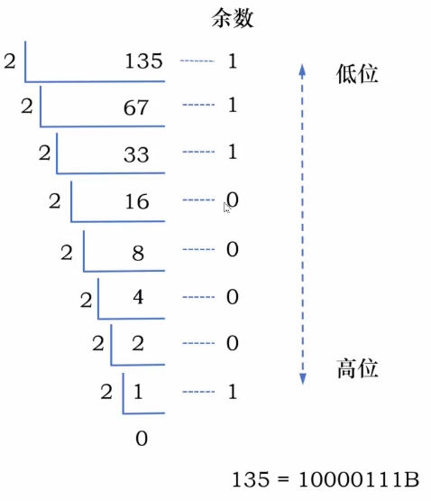

## 十进制、二进制之间转换很繁琐  
* 十进制转二进制太繁琐。
* 二进制表示法太冗长了。
## 十六进制  
二进制：0、1。  
十进制：0、1、2、3、4、5、6、7、8、9。  
十六进制：0、1、2、3、4、5、6、7、8、9、A、B、C、D、E、F。  
“H”表示的是十六进制数。  
十进制转十六进制也可以使用“除基取余，上右下左”的方法。  

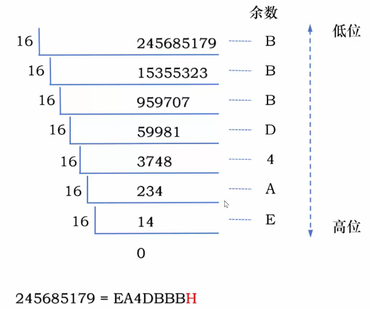

十六进制与二进制数之间的转换：1 位十六进制位 = 4 位二进制位。  

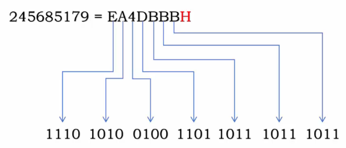

# 指令的设计和执行过程  
在计算机中，指令本质是一串二进制位。  
指令操作：  
* 取数操作。
* 运算操作：加、减、乘、除。
* 存数操作。
* 打印操作。
一条指令由**操作码**和**地址码**（目的地址码 + 源操作数地址码）组成。例如：0000 0011 0000 0110。  
0000：表示操作码；0011 0000 0110：表示地址码。  

```vtable
{"rows":[[{"t":"操作码<br>","rs":1,"cs":1},{"t":"操作类型","rs":1,"cs":1}],[{"t":"0000","rs":1,"cs":1},{"t":"取数操作","rs":1,"cs":1}],[{"t":"0001","rs":1,"cs":1},{"t":"存数操作","rs":1,"cs":1}],[{"t":"0010","rs":1,"cs":1},{"t":"加法操作","rs":1,"cs":1}],[{"t":"0011","rs":1,"cs":1},{"t":"减法操作","rs":1,"cs":1}],[{"t":"0100","rs":1,"cs":1},{"t":"打印操作","rs":1,"cs":1}],[{"t":"0101","rs":1,"cs":1},{"t":"停机操作","rs":1,"cs":1}]],"colWidths":[220,271]}
```

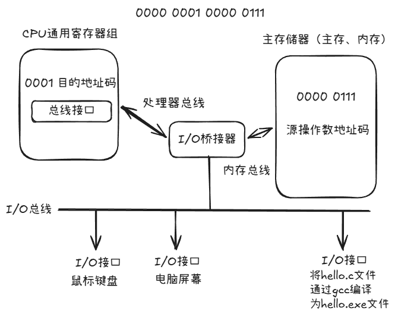

解释：0000 是取址操作，CPU 通用寄存器通过 0000 0111 源操作数地址码将数据 7 加载到通用寄存器目标地址码为 0001 的寄存器中。 
目的地址码：去的地方。  
源操作数地址码：来的地方。 
例子：存在表达式 $ax+b$，a = 5 = 0000 0101 B；x = 6 = 0000 0110 B；b = 12 = 0000 1100 B。  

```vtable
{"rows":[[{"t":"变量","rs":1,"cs":1},{"t":"值","rs":1,"cs":1},{"t":"内存地址","rs":1,"cs":1}],[{"t":"a","rs":1,"cs":1},{"t":"5","rs":1,"cs":1},{"t":"0001 0010","rs":1,"cs":1}],[{"t":"x","rs":1,"cs":1},{"t":"6","rs":1,"cs":1},{"t":"0001 0011","rs":1,"cs":1}],[{"t":"b","rs":1,"cs":1},{"t":"12","rs":1,"cs":1},{"t":"0001 0100","rs":1,"cs":1}]]}
```


```vtable
{"rows":[[{"t":"","rs":1,"cs":1},{"t":"通用寄存器","rs":1,"cs":1}],[{"t":"0000","rs":1,"cs":1},{"t":"0号寄存器","rs":1,"cs":1}],[{"t":"0001","rs":1,"cs":1},{"t":"1号寄存器","rs":1,"cs":1}],[{"t":"0010","rs":1,"cs":1},{"t":"2号寄存器","rs":1,"cs":1}],[{"t":"0011","rs":1,"cs":1},{"t":"3号寄存器","rs":1,"cs":1}]]}
```

如何计算表达式：$ax+b$。  
1. 取数：将 a 加载到 0 号寄存器（R 0）。寄存器即 CPU 中的通用寄存器。指令：0000 0000 0001 0010
2. 取数：将 x 加载到 1 号寄存器（R 1）。指令：0000 0001 0001 0011
3. 乘法：将 0 号寄存器的值和 1 号寄存器的值做乘法，结果送到 0 号寄存器。指令：0011 0000 0000 0001
4. 取数：将 b 加载到 1 号寄存器。指令：0000 0001 0001 0100
5. 加法：将 0 号寄存器的值和 1 号寄存器的值做加法，结果送到 0 号寄存器。指令：0010 0000 0000 0001
6. 存数：将 0 号寄存器的值存放到内存地址为 0001 0101 的存储单元。指令：0001 0001 0101 0000

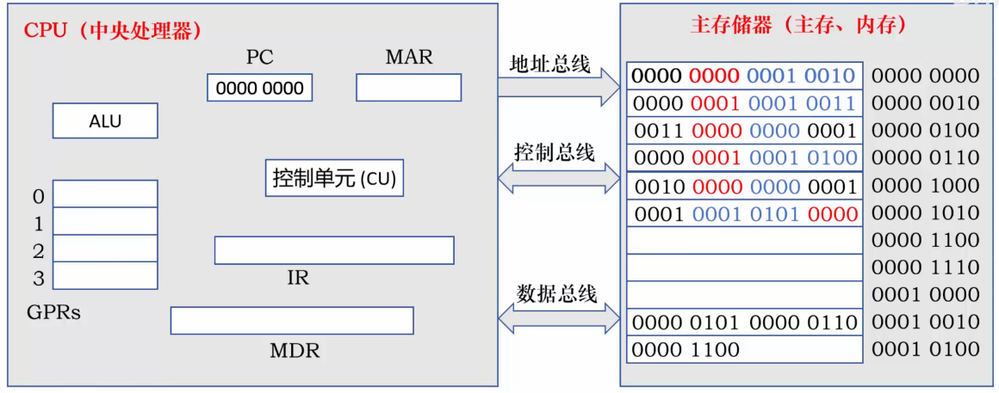

* 通用寄存器（General Purpose Register set, GPRs）：CPU 内部的**临时存数仓库**，用来存放操作数或中间结果，减少访问内存的次数。
* 程序计数器（Program Counter, PC）：专用寄存器。存放下一条**指令所在的内存地址**。CPU 根据它去取指令。指令占用两个字节，一般为途中的 0000 0000、0000 0010 ...。
* 指令寄存器（Instruction Register, IR）：存放当前正在**执行**的那条**指令**本身（即指令的二进制编码）。
* 内存地址寄存器（Memory Address Register, MAR）：存放待访问**内存单元**的**地址**。它直接连接地址总线。
* 内存数据寄存器（Memory Date Register, MDR）：存放从内存**读入**或准备**写入**内存的**数据**。它直接连接数据总线。
* 算术逻辑单元（Arithmetic and Logic Unit, ALU）：负责执行所有**算术运算**（加减乘除）和**逻辑运算**（与或非）。
* 控制单元（Control Unit, CU）：CPU 的“总司令”，负责**译码**（解读 IR 里的指令），并发送**微操作控制信号**指挥其他部件。


## 总结指令的执行过程  
PC：  
1. 根据 PC 取指令到 IR。
2. 指令译码并送出控制信号。
3. 根据控制信号完成指定操作。

# 冯·诺依曼计算机结构的 5 个特点  
1. 计算机由运算器、控制器、存储器、输入设备和输出设备 5 个基本部件组成。

运算器是计算机的执行部件：  
	1. 算数运算：加、减、乘、除等。  
	2. 逻辑运算：与、或、非、异或、移位等。  

核心部件：ALU 和通用寄存器组（GRPs）。
输入设备的主要功能是将程序和数据以及机器所能识别和接受的信息形式输入计算机。  
最常用也最基本的输入设备是键盘，此外还有鼠标、扫描仪、摄像机等。  
输出设备的任务是将计算机处理的结果以人们所能接受的形式或其他系统所要求的信息形式输出。  
最常见、最基本的输出设备是显示器、打印机。  
控制器是计算机的指挥中心，由其“指挥”各部件自动协调地进行工作：程序计数器（PC）、指令寄存器（IR）、控制单元（CU）。  


> 冯·诺依曼计算机以**运算器**为中心，现代计算机以**存储器**为中心。


2. 指令和数据以同等地位存储在存储器中，形式上没有区别，但计算机应能区分它们。
3. 指令和数据均用二进制代码表示。
4. 指令由操作码和地址码组成两部分组成，地址码可以是多个。
5. 采用“存储程序”工作方式。

“存储程序”的基本思想是：将事先编制好的程序和原始数据送入主存储器后才能执行，一旦程序被启动执行，就无须操作人员的干预，计算机会自动逐条执行指令，直至程序执行结束。  
# 程序的编译执行过程  
## 什么是机器语言、汇编语言和高级语言  


## 高级语言程序翻译成机器语言程序：编译器  

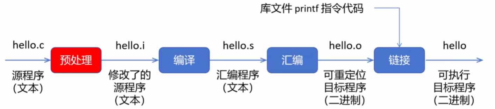

``` c
gcc -E hello.c -o hello.i
gcc -S hello.i -o hello.s
gcc -c hello.s -o hello.o
gcc hello.o -o hello
```

编译器：将高级语言**一次性**翻译成汇编语言或者机器语言目标程序。  
## 高级语言程序翻译成机器语言程序：解释器  
解释器：将源程序中的语句按其执行顺序逐条翻译成机器指令并立即执行。  
## 编译执行和解释执行  

```vtable
{"rows":[[{"t":"","rs":1,"cs":1},{"t":"执行速度","rs":1,"cs":1},{"t":"开发周期","rs":1,"cs":1},{"t":"","rs":1,"cs":1}],[{"t":"编译执行","rs":1,"cs":1},{"t":"快","rs":1,"cs":1},{"t":"长","rs":1,"cs":1},{"t":"C、C++、Go等","rs":1,"cs":1}],[{"t":"解释执行","rs":1,"cs":1},{"t":"慢","rs":1,"cs":1},{"t":"短","rs":1,"cs":1},{"t":"Python、JavaScript等","rs":1,"cs":1}]]}
```

> Java 既有编译执行，又有解释执行。  

# 程序员最重要的能力：抽象能力  
抽象是形成概念的一种方法：大部分时间并不是在写代码，而是在梳理需求、理清抽象概念。  
# 器件和逻辑电路
## 计算机系统的层次结构（抽象分层思想）  


```vtable
{"rows":[[{"t":"应用（问题）","rs":1,"cs":1},{"t":"比如图书馆管理系统（学生表、课程表等）","rs":1,"cs":1}],[{"t":"算法","rs":1,"cs":1},{"t":"线性表、树形结构、图结构等","rs":1,"cs":1}],[{"t":"编程语言","rs":1,"cs":1},{"t":"数据类型（基本类型、指针类型等）","rs":1,"cs":1}],[{"t":"操作系统","rs":1,"cs":1},{"t":"进程、地址空间、文件等","rs":1,"cs":1}],[{"t":"功能部件","rs":1,"cs":1},{"t":"主存储器、CPU（加速器、乘法器、控制器）、I/O设备等","rs":1,"cs":1}],[{"t":"逻辑电路","rs":1,"cs":1},{"t":"与门电路、或门电路、非门电路等","rs":1,"cs":1}],[{"t":"器件","rs":1,"cs":1},{"t":"晶体管、电容等","rs":1,"cs":1}]]}
```

中间的每一层的功能都是利用下面一层提供的基本服务来完成了，每一层又为上一层提供更强大的服务。  
## 晶体管（场效应管-MOS 管）  
半导体：掺了硼元素、磷元素的硅

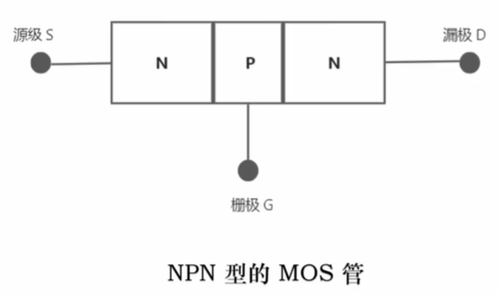

N 表示负极，英文 Negative 的首字母。  
P 表示正极，英文 Positive 的首字母。  
## NMOS：电压控制的开关  

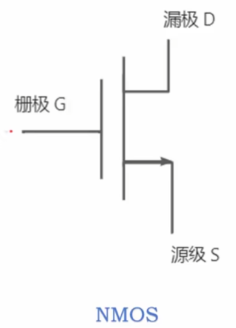

当给栅极施加电压：  
* 当电压**高于**某阈值电压时，这个开关**可以**导通。
* 当电压**低于**某阈值电压时，这个开关**就不**导通。

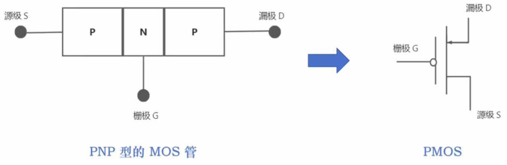

当给栅极施加电压：  
* 当电压**高于**某阈值电压时，这个开关**就不**导通。
* 当电压**低于**某阈值电压时，这个开关**可以**导通。

高于某阈值的电压，统称为高压；低于某阈值的电压，统称为低压。  
* NMOS：高压导通，低压不导通。
* PMOS：高压不导通，低压导通。

## 逻辑计算：非、或、与  
### 电路实现逻辑非

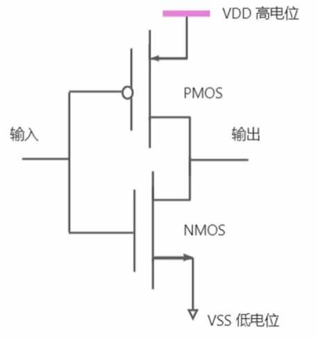

输入高电位，PMOS 不导通，NMOS 导通，输出低点位。  
输入低点位，PMOS 导通，NMOS 不导通，输出高点位。

```vtable
{"rows":[[{"t":"输入","rs":1,"cs":1},{"t":"输出","rs":1,"cs":1}],[{"t":"1","rs":1,"cs":1},{"t":"0","rs":1,"cs":1}],[{"t":"0","rs":1,"cs":1},{"t":"1","rs":1,"cs":1}]]}
```

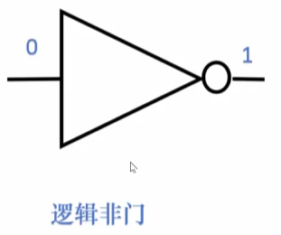

### 电路实现逻辑或  

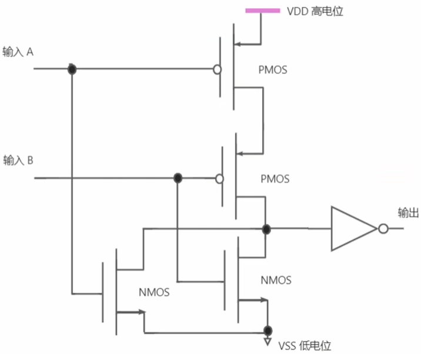

输入 A 高电位，PMOS 不导通，NMOS 导通，输入 B 高电位，PMOS 不导通，NMOS 导通，输出高点位。  
同理，输入 A 高电位，输入 B 低电位，输出高电位。  
输入 A 低电位，输入 B 高电位，输出高电位。  
输入 A 低电位，输入 B 低电位，输出低电位。  

```vtable
{"rows":[[{"t":"输入A","rs":1,"cs":1},{"t":"输入B","rs":1,"cs":1},{"t":"输出","rs":1,"cs":1}],[{"t":"1","rs":1,"cs":1},{"t":"1","rs":1,"cs":1},{"t":"1","rs":1,"cs":1}],[{"t":"1","rs":1,"cs":1},{"t":"0","rs":1,"cs":1},{"t":"1","rs":1,"cs":1}],[{"t":"0","rs":1,"cs":1},{"t":"1","rs":1,"cs":1},{"t":"1","rs":1,"cs":1}],[{"t":"0","rs":1,"cs":1},{"t":"0","rs":1,"cs":1},{"t":"0","rs":1,"cs":1}]]}
```

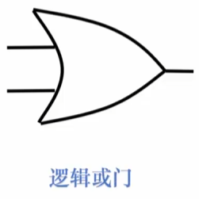

### 电路实现逻辑与

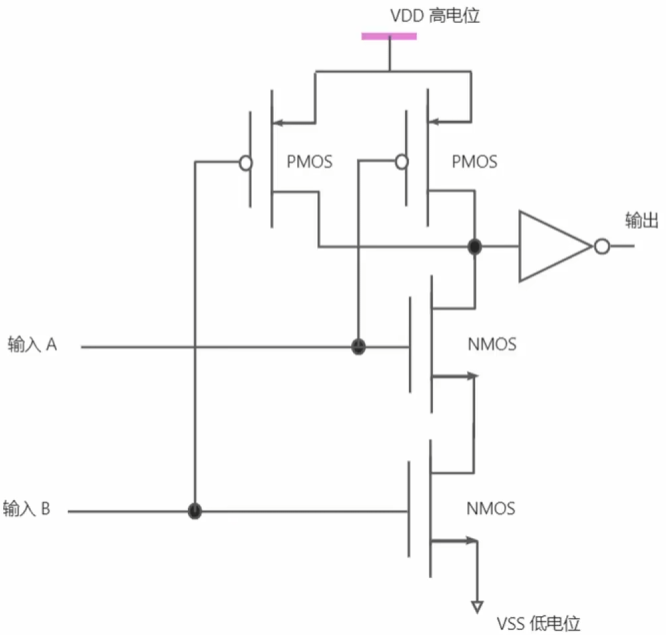

```vtable
{"rows":[[{"t":"输入A","rs":1,"cs":1},{"t":"输入B","rs":1,"cs":1},{"t":"输出","rs":1,"cs":1}],[{"t":"1","rs":1,"cs":1},{"t":"1","rs":1,"cs":1},{"t":"1","rs":1,"cs":1}],[{"t":"1","rs":1,"cs":1},{"t":"0","rs":1,"cs":1},{"t":"0","rs":1,"cs":1}],[{"t":"0","rs":1,"cs":1},{"t":"1","rs":1,"cs":1},{"t":"0","rs":1,"cs":1}],[{"t":"0","rs":1,"cs":1},{"t":"0","rs":1,"cs":1},{"t":"0","rs":1,"cs":1}]]}
```

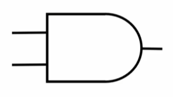

### 电路实现：异或  

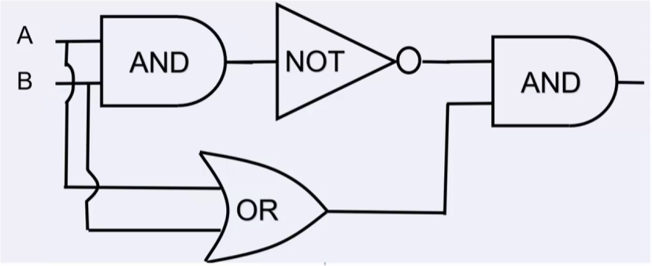

```vtable
{"rows":[[{"t":"输入A","rs":1,"cs":1},{"t":"输入B","rs":1,"cs":1},{"t":"输出","rs":1,"cs":1}],[{"t":"1","rs":1,"cs":1},{"t":"1","rs":1,"cs":1},{"t":"0","rs":1,"cs":1}],[{"t":"1","rs":1,"cs":1},{"t":"0","rs":1,"cs":1},{"t":"1","rs":1,"cs":1}],[{"t":"0","rs":1,"cs":1},{"t":"1","rs":1,"cs":1},{"t":"1","rs":1,"cs":1}],[{"t":"0","rs":1,"cs":1},{"t":"0","rs":1,"cs":1},{"t":"0","rs":1,"cs":1}]]}
```

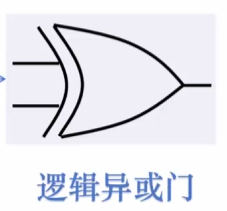

# 计算机系统的层次结构（抽象分层思想）  
## 计算机系统的层次结构——两个体系结构  
指令集体系结构（Instruction Set Architure, ISA）是对指令系统的一种规定或结构规范，是软件和硬件之间的接口。  
1. 定义了一台计算机可以执行的所有指令的集合。
2. 规定了每条指令对应计算机执行什么操作。
3. 指令处理的操作数存放的位置以及操作数类型。

微体系结构（microarchitecture）：ISA 的具体逻辑实现，关注于处理器内部的硬件设计和实现细节。  
1. 指令的流水线设计。
2. 加法器采用串行进位方式还是并行进位方式。
3. 存储器的结构（如寄存器堆，Cache 的结构）。

## 软件和硬件在逻辑功能上是等价的  
软件能实现的功能，硬件也可以实现。  
硬件能实现的功能，软件也可以实现。  
## 应用软件和系统软件  
应用软件：专门为数据处理、科学计算、事务管理、多媒体处理、工程设计以及过程控制等应用所编写的各类程序都称为**应用软件**。  
系统软件：**系统软件**包括为有效、安全地使用和管理计算机以及开发和运行应用软件而提供的各种软件。  
操作系统（如 Windows）主要用来管理整个计算机系统的各种资源，包括对它们进行调度、管理、监视和服务等，操作系统还提供计算机用户和硬件之间的人机交互界面，并提供对应软件的支持。
语言处理系统（如 C 语言编译器）主要用于提供一个用高级语言编程的环境，包括源程序编辑、翻译、调试、链接、转入运行等功能。  
数据库管理系统（如 Oracle）是一种用于建立、使用和维护数据库的软件系统。  
# 计算机系统中三个性能指标  
## 计算机性能评估：CPU 时钟周期  

> 至于每一个时钟周期内执行哪些操作，发送哪些控制信号，这就设计到了 CPU 的数据通路和控制器的问题，在第五章【中央处理器】的数据通路和控制器章节会详细说明。  

## 计算机性能评估：CPU 时钟频率（主频）
$CPU主频=\dfrac{1}{CPU时钟周期}$
## 计算机性能评估：CPI（Cycles Per Instruction）  
CPI（Cycles Per Instruction）：执行一条指令需要的时钟周期数。  
一条特定指令——CPI 就是指执行该指令所需的时钟周期数。  
一个程序——**该程序**所有指令执行所需的**平均**时钟周期数。  
一台机器——**该机器指令集中**所有指令执行所需的**平均**时钟周期数。  

## 计算机性能评估：CPU 执行时间  
$CPU执行时间=程序总指令条数\times CPI\times时钟周期$
假设某个频率使用的程序 P 在机器 M 1 上运行需要 10 s，M 1 的时钟频率为 2 GHz。设计人员想开发一台与 M 1 具有**相同 ISA 的新机器 M 2。采用新技术可使 M 2 的时钟频率增加，但同时也会使 CPI 增加。假定程序 P 在 M 2 上的时钟周期是在 M 1 的 1.5 倍，则 M 2 的时钟频率至少达到多少才能使得程序 P 在 M 2 上的运行时间缩短为 6 s？  
M 1 机器：CPU 执行时间 10 s，程序总指令条数 n，CPI m，时钟周期 $\dfrac{1}{2GHz}$ s。  
M 2 机器：CPU 执行时间 6 s，程序总指令条数 n，CPI 1.5 m，时钟周期 $\dfrac{1}{x}$。  
$\dfrac{10s}{6s}=\dfrac{n·m·\dfrac{1}{2GHz}s}{n·1.5m·\dfrac{1}{x}s}=\dfrac{x}{1.5·2GHz}\to x= 5GHz$
# 计算机系统的三个性能评估方式  
## 方式一：用指令执行速度进行性能评估  
IPS（Instructions Per Second），即平均每秒执行多少条指令。  
平均 CPI 是执行一条指令平均需要的时钟周期  
$\to$
$一条指令执行平均时间=平均CPI\times时钟周期$  
$IPS=\dfrac{1}{平均CPI\times时钟周期}=\dfrac{主频}{平均CPI}$
MIPS（Million Instruction Per Second）：平均每秒执行多少百万条指令。  
$MMIPS=\dfrac{IPS}{10^6}$

 


